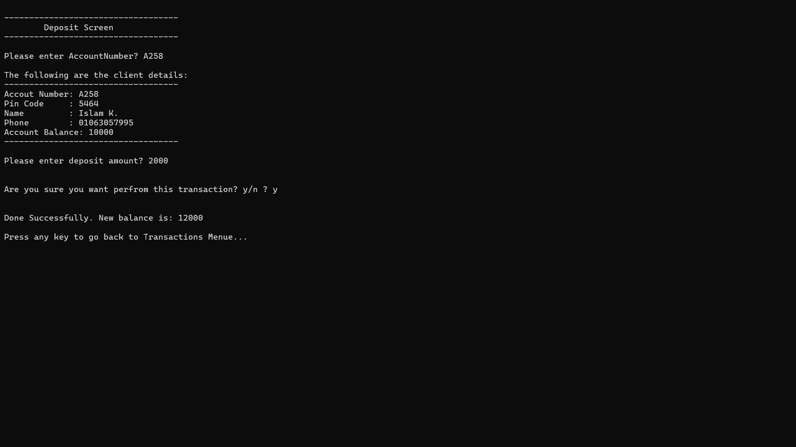

# 🏦 Bank Management System

A comprehensive C++ console-based banking application with user management, transaction handling, and permission-based access control.

## 📋 Features

### 👥 User Management
- **Login System** with username/password authentication
- **Default Admin Account** (Username: `Admin`, Password: `1234`)
- **Permission-Based Access Control**
- Add, Delete, Update, and Find Users
- Cannot delete Admin user

### 💰 Client Management
- Add, Delete, Update, and Find Clients
- View All Clients with detailed information
- Client data includes: Account Number, PIN, Name, Phone, Balance

### 💵 Transactions
- **Deposit** money to client accounts
- **Withdraw** money with balance validation
- **View Total Balances** for all clients

### 🔐 Permissions System
The system supports 7 different permission levels:
1. List Clients
2. Add New Client
3. Delete Client
4. Update Client
5. Find Client
6. Transactions
7. Manage Users

**Full Access**: Admin has all permissions (value: `-1`)

## 🚀 Getting Started

### Prerequisites
- Visual Studio 2019/2022 or any C++ compiler
- Windows OS (uses `system("cls")` and `system("pause>0")`)

### Installation

1. **Clone the repository**
```bash
git clone https://github.com/YourUsername/BankManagementSystem.git
cd BankManagementSystem
```

2. **Compile and Run**
```bash
# Using g++
g++ FileName.cpp -o BankSystem.exe

# Or open in Visual Studio and press F5
```

3. **First Run**
- The system automatically creates an Admin user if none exists
- Login with: **Username:** `Admin` | **Password:** `1234`

## 📁 File Structure

```
BankManagementSystem/
│
├── FileName.cpp          # Main source code
├── Clients.txt           # Client data storage (auto-generated)
├── Users.txt             # User data storage (auto-generated)
├── README.md            # This file
└── .gitignore           # Git ignore rules
```

## 💾 Data Storage

### Users File Format (`Users.txt`)
```
Username#//#Password#//#Permissions
```
Example: `Admin#//#1234#//#-1`

### Clients File Format (`Clients.txt`)
```
AccountNumber#//#PinCode#//#Name#//#Phone#//#Balance
```
Example: `A101#//#1234#//#John Doe#//#0123456789#//#5000.00`

## 📸 Screenshots

### Transaction Menu


### Deposit


### Total Balance


### Manage Users Menu


### Users List


### Add New User


### Add New Client


### Find Client


### Update Client


## 🔧 How to Use

### Adding a New Client
1. Login as Admin or user with "Add Client" permission
2. Select option `[2] Add New Client`
3. Enter client details:
   - Account Number (must be unique)
   - PIN Code
   - Name
   - Phone
   - Initial Balance

### Managing Permissions
When creating a new user, you can grant specific permissions:
- **Full Access**: User has all system permissions
- **Custom Access**: Choose specific permissions individually

### Performing Transactions
1. Select `[6] Transactions` from main menu
2. Choose operation:
   - **Deposit**: Add money to account
   - **Withdraw**: Remove money (validates sufficient balance)
   - **Total Balances**: View sum of all client balances

## 🛡️ Security Features

- ✅ Username/Password authentication
- ✅ Permission-based access control
- ✅ Admin account protection (cannot be deleted)
- ✅ Balance validation on withdrawals
- ✅ Duplicate account number prevention
- ✅ Duplicate username prevention

## 🐛 Known Limitations

- Console-based UI only (no GUI)
- Windows-specific system calls (`cls`, `pause`)
- Data stored in plain text files (not encrypted)
- No network/multi-user support
- Single-session only

## 🔮 Future Enhancements

- [ ] Add data encryption for sensitive information
- [ ] Implement transaction history/logging
- [ ] Add date/time stamps to transactions
- [ ] Create database backend (SQLite/MySQL)
- [ ] Build GUI interface (Qt/wxWidgets)
- [ ] Add data export (CSV, PDF reports)
- [ ] Implement account statements
- [ ] Add interest calculation features

## 👨‍💻 Author

**Your Name**
- GitHub: [@YourUsername](https://github.com/YourUsername)

## 📄 License

This project is licensed under the MIT License - see the [LICENSE](LICENSE) file for details.

## 🤝 Contributing

Contributions, issues, and feature requests are welcome!

1. Fork the project
2. Create your feature branch (`git checkout -b feature/AmazingFeature`)
3. Commit your changes (`git commit -m 'Add some AmazingFeature'`)
4. Push to the branch (`git push origin feature/AmazingFeature`)
5. Open a Pull Request

## ⭐ Show your support

Give a ⭐️ if this project helped you!

---

**Note**: This is an educational project for learning C++ file handling, data structures, and system design concepts.
